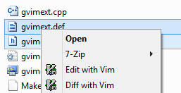

This module improves the Windows Explorer integration of gVim.

It add two context menu items to the Windows Explorer:

Edit with Vim
Diff with Vim (when more than one file is selected but less than five)
It add the vimicon to the context menu.
If the file is already open in gVim the extension will switch to that tab.
If the shift key is hold then a new instance of gVim will be started to edit the file.

To install the extension:

copy the correct (x64 or Win32) gvimext.dll in the folder of the restart_explorer.bat
Adapt the restart_explorer.bat script to your vim installation path and
Run the script.
The code have been tested under Windows 7.
It has been compiled with VisualStudio 2010.

The  is a screenshot of the Windows Explorer with the new gVimExt.
